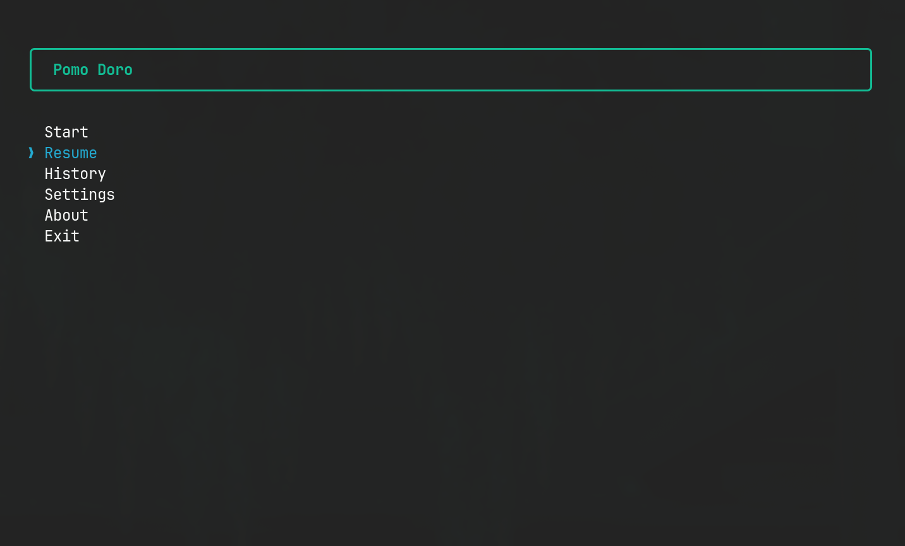
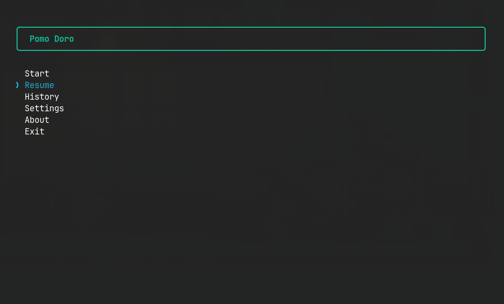
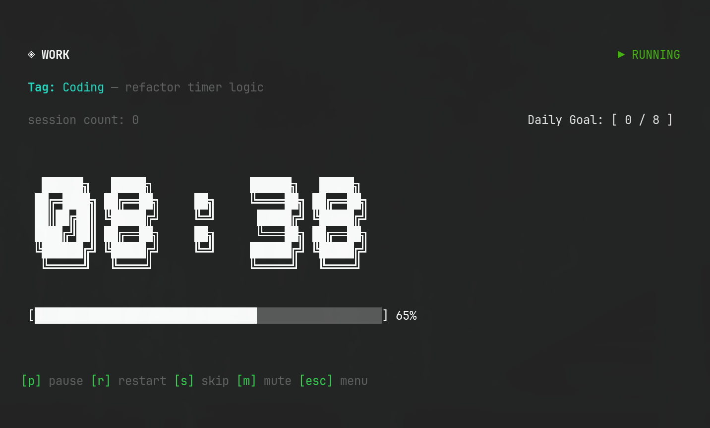
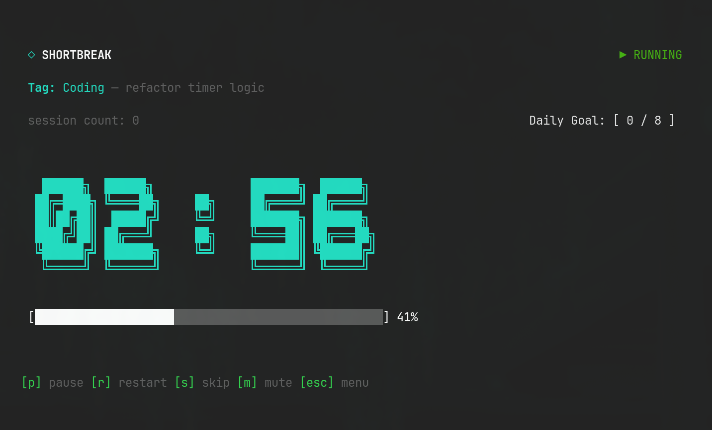
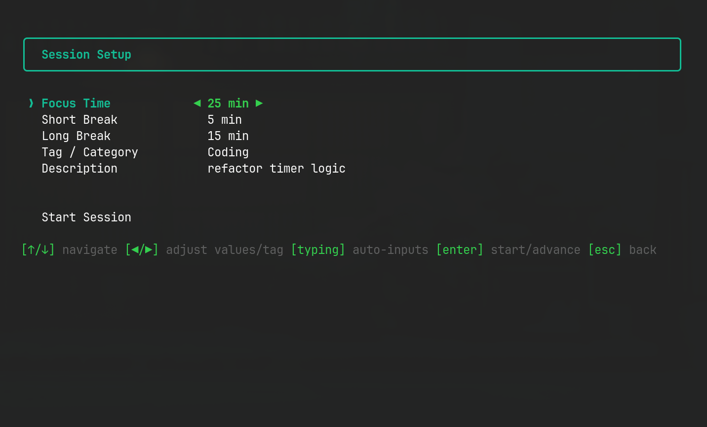
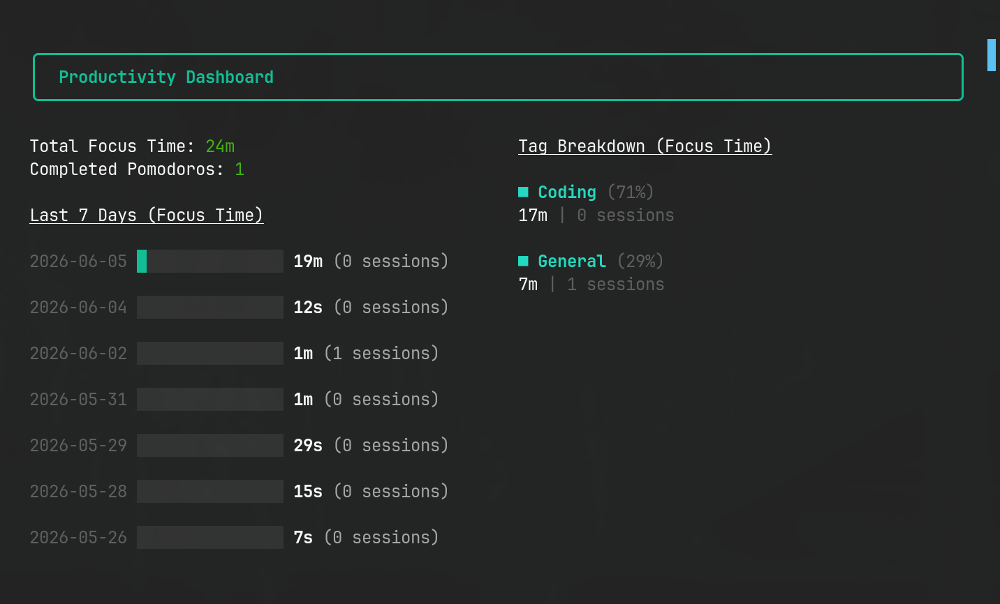
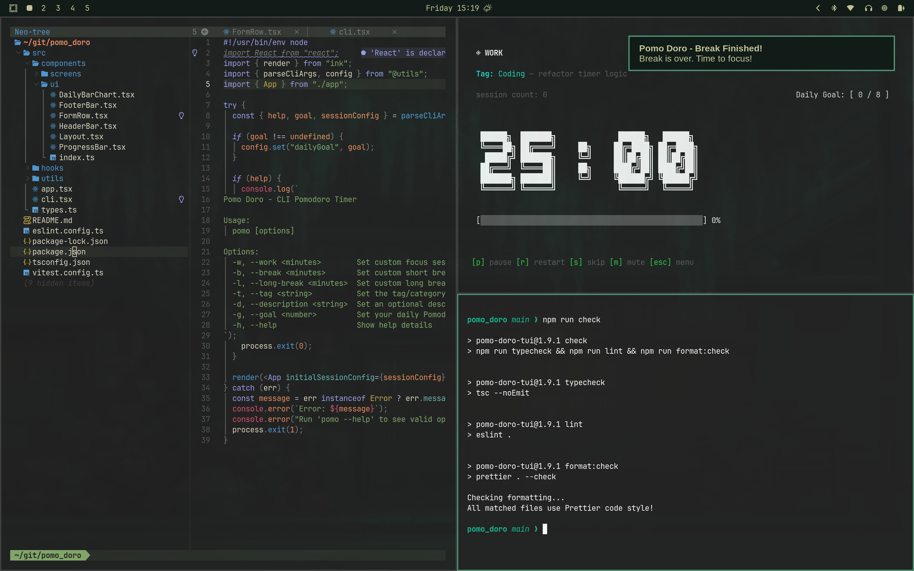
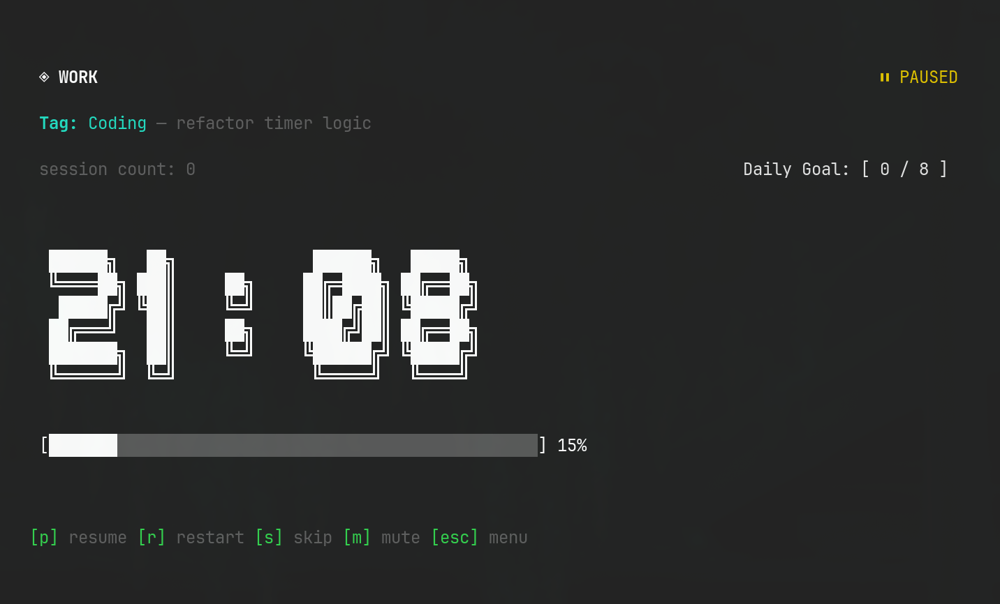
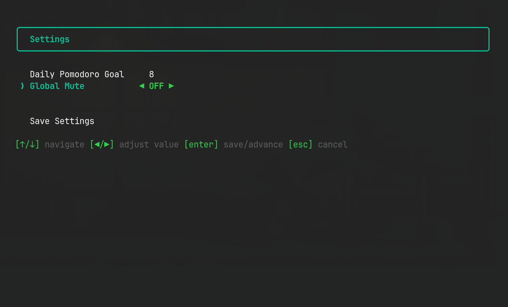

## Overview

When it comes to staying focused, the Pomodoro Technique is one of the simplest and most effective frameworks out there. But when I wanted to bring it to my workflow, I ran into a bit of a goldilocks problem. I wanted a Pomodoro timer that was:

- housed completely in the terminal (no distracting browser tabs),
- clean, modern, and readable from a distance,
- secure, local-first, and lightweight,
- and smart enough to handle breaks and save my progress.

When I couldn't find a CLI tool that ticked all of those boxes, there was only one logical developer response: **build it myself**.

That's what led to **Pomo Doro**—a modular, React-powered Pomodoro TUI (Terminal User Interface). It turns out, building a terminal-based timer has some interesting challenges, from drawing UI grids inside a shell to managing state persistence so you don't lose your focus logs when you close a tab.

If you want to view the source code or install it yourself, the repository is right here: [github.com/dandrok/pomo_doro](https://github.com/dandrok/pomo_doro).

> [!NOTE]
> **A quick backstory on how it was built:**
> I started writing the initial version by hand, but partway through, I found myself traveling across Japan in "adventure mode" during May 2026. Without much dedicated focus time on bumpy trains, I decided to level up my AI collaboration skills. I paired up with my AI assistant (Antigravity CLI Gemini) to co-author components, implement TypeScript path aliases, and wire up the testing suite. Writing code while looking at Mount Fuji from a Shinkansen bullet train at 300 km/h was quite the experience!

---

## What Pomo Doro Does

Pomo Doro isn't just a simple shell stopwatch. It's a complete productivity workspace for the terminal. Some of its core features include:

1. **A Clean TUI Layout:** Built-in big text and progress bars that let you check your status at a glance, even if the terminal window is in a corner of your screen.
2. **Automatic Session Cycling:** Cycle between Work and Short Breaks automatically, with every 4th focus session triggering a Long Break via a clean modulo-4 schedule.
3. **Interactive Setup Wizard:** If the default 25/5/15 interval doesn't match your flow, you can spin up a custom session using an interactive configuration menu. You can even assign **tags** and **descriptions** to categorize your work.
4. **Local State Persistence:** Automatically remembers your active session and tracks your progress. If you accidentally close your terminal, you can resume right where you left off.
5. **Productivity Dashboard & Daily Goals:** A dedicated screen showing your daily focus stats, a 7-day productivity history bar chart, and tools to track your daily Pomodoro goal.
6. **Native Alerts & Keyboard Controls:** Integrates with system-level notifications and audio warnings. You can easily mute alerts (`m`), skip sessions (`s`), or pause (`p`) using quick keyboard shortcuts.
7. **CLI Arguments:** Bypass the menus entirely by passing arguments directly from your shell (e.g., `pomo --work 50 --break 10`).
8. **Interactive Settings Menu:** Easily configure your daily goals and toggle OS notifications on the fly.
9. **Development Sandbox:** Features a dedicated test mode with ultra-short timers for rapid testing and contribution.

---

## The Tech Stack: React in the Terminal?

Yes, you read that correctly. We are running a virtual DOM inside your shell to render Flexbox layouts.

The stack consists of:

- **TypeScript** for code safety and robust types.
- **Node.js** as the runtime.
- **Ink** for React-based terminal rendering.
- **Conf** for local state and history persistence.
- **Vitest** for unit testing hooks and history logic.
- **Tsup** for bundling the code into a single, lightning-fast executable.

For anyone who hasn't worked with it, **Ink** translates React components into ANSI escape codes. Instead of browser tags like `<div>` or `<span>`, you use `<Box>` and `<Text>`.

To make the timer look cool and readable, I integrated `ink-big-text` to render the clock. The layout is kept modular, clean, and extremely easy to maintain. Here is how the project is organized:

```text
src/
├── cli.tsx                     # CLI application entry point
├── app.tsx                     # Top-level application router
├── components/
│   ├── screens/                # High-level screens
│   │   ├── MainMenu.tsx        # Main navigation menu
│   │   ├── Timer.tsx           # Active timer & progress bar
│   │   ├── SessionSetup.tsx    # Custom interval wizard
│   │   ├── History.tsx         # Productivity logs screen
│   │   ├── Settings.tsx        # Interactive settings menu
│   │   └── Resume.tsx          # Resumes a interrupted timer
│   └── ui/                     # Reusable visual building blocks
│       ├── Layout.tsx          # Consistent border styling
│       ├── DailyBarChart.tsx   # TUI chart for focus history
│       └── ProgressBar.tsx     # Custom terminal progress bar
├── hooks/
│   ├── useTimer.ts             # Countdown & state management hook
│   └── usePomodoroSession.ts   # Session cycle logic
├── utils/
│   ├── config.ts               # Local Conf-based database client
│   ├── cliParser.ts            # Command-line arguments parser
│   └── notifications.ts        # OS-level notify & sound engine
└── types.ts                    # Centralized TypeScript definitions
```

---

## Why Local-First Persistence Matters (Enter `conf`)

One of the biggest issues with simple terminal utilities is that they are ephemeral. If your laptop battery dies, if you close your terminal pane, or if you accidentally press `Ctrl+C`, your timer is gone and your productivity logs are wiped out.

To solve this, Pomo Doro uses the `conf` library.

Whenever the active timer ticks down, it writes the current session's snapshot to disk in a simple local JSON file.

```typescript
// Persist current session state on every tick or mode change
useEffect(() => {
  config.set('activeSession', {
    timeOut: secondsRemaining,
    mode,
    focus,
    shortBreak,
    longBreak,
    pomodoroCount,
  });
  config.set('pomodoroCount', pomodoroCount);
}, [secondsRemaining, mode, pomodoroCount]);
```

When you reopen the app, the app detects that an active session was interrupted and presents a **Resume Screen**:



This local-first storage is fast, requires zero database setup, and keeps your work logs entirely private on your own hard drive.

---

## The Technical Nitty-Gritty

Building a countdown timer in React inside a terminal environment comes with a few funny quirks.

### Avoiding Timer Drifts in the Event Loop

If you've ever built a timer in vanilla JavaScript, you know that `setInterval` is notoriously unreliable. It drifts based on what is happening in the event loop. In a terminal app, rendering updates can sometimes block execution for brief moments.

To keep things accurate and lightweight, Pomo Doro uses a custom React hook `useTimer` which sets a single `setTimeout` that triggers every 1,000 milliseconds and decrements state. By relying on a functional update:

```typescript
setSecondsRemaining((prev) => prev - 1);
```

we avoid stale closures and ensure that even if the rendering pipeline lags for a millisecond, the countdown logic stays rock solid.

### Continuous Integration and NPM Distribution

Because I wanted this tool to be accessible globally with a simple `npm install -g pomo-doro-tui`, I used **tsup** to bundle the whole project. Tsup compiles all of our TypeScript files, bundles dependencies, and outputs a single minified ESM binary (`dist/cli.js`) targeted at node environments.

The release workflow is automated using GitHub Actions. On every pull request, it runs:

- `npm run typecheck` to verify TypeScript types,
- `npm run lint` for code styling,
- `npm run test` using **Vitest** to run unit tests on hooks and utility logic.

When a new version tag is released, the GitHub Action automatically builds the project and publishes it to the NPM registry.

---

## Visual Walkthrough

Here is what the interface looks like in action:

### Main Menu

The starting screen lets you choose presets, access the custom wizard, or check your history.


### Active Pomodoro Timer

A working Pomodoro session with large ASCII numbers and a dynamic terminal progress bar.


### Break Session

When it's time to rest, the UI switches to a relaxing color scheme.


### Custom Wizard Setup

Need a 50-minute work session and a 10-minute break? Navigate fields using arrow keys.


### Productivity History

Check your completed Pomodoro sessions over the last 7 days represented as an ASCII bar chart.


### Native Notifications

Receive native toast notifications at the start and end of break cycles.


### Paused Screen

Pause and resume controls in action.


### Settings Menu

Dynamically change your preferences, like your daily Pomodoro goal and alert toggles.


---

## Future Roadmap

The current version of Pomo Doro covers the essential workflow, but as a passionate open-source project, the roadmap is always evolving. Potential future enhancements could include:

- **Cloud Syncing:** Adding an optional backend connection so sessions can be synced across multiple devices.
- **Advanced Analytics:** Exploring deeper insights, like exporting data to CSV or visualizing productivity trends by tag.
- **More Theming Options:** Allowing custom color schemes for the TUI elements.

## Final Thoughts

Pomo Doro started as a personal tool because I couldn't find a lightweight terminal timer that met my workflow needs. By combining **React Ink**, **Conf** persistence, and modern developer tooling, it evolved into a fun, robust utility that I use every single day.

If you are a terminal enthusiast who values keyboard-driven productivity and local-first data, give it a try:

```bash
npm install -g pomo-doro-tui
pomo
```

Have a nice day, keep coding, and never stop learning! 🚀
